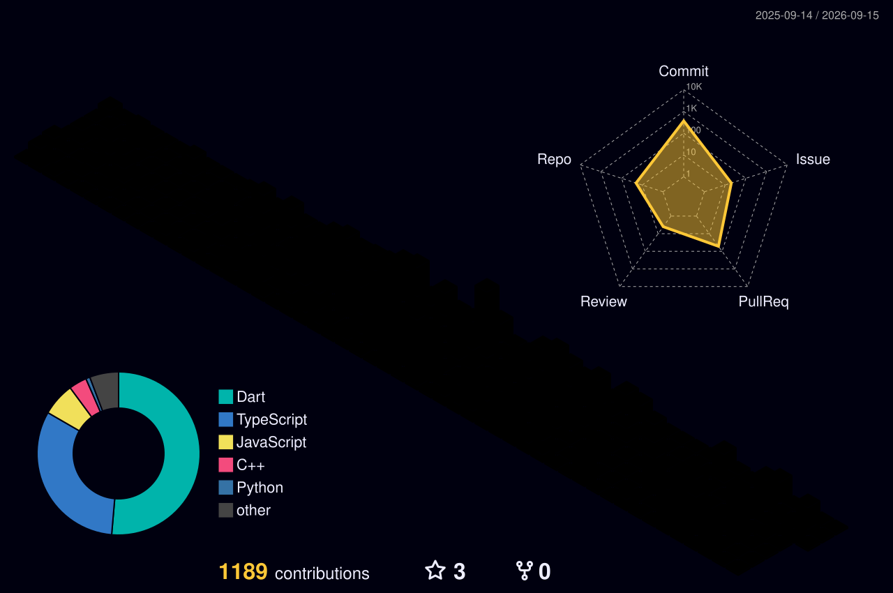
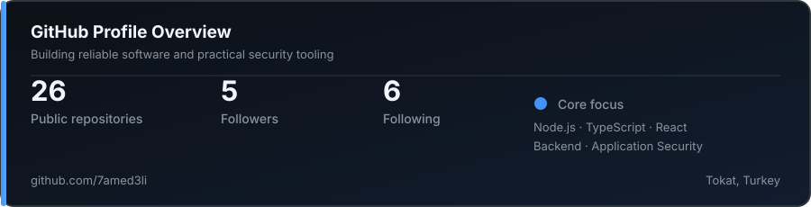

<div align="center">


</div>

<div align="center">


</div>

<br/>

---

<div align="center">

```
I build production-ready software,
optimize systems under real-world load,
and solve security problems that matter.
```

</div>

---

<br/>



<br/>

---

## `$ whoami`

```yaml
name:        Hamed Mohamed Abdelalim
role:        Software Engineer — Backend, Full-Stack & Application Security
degree:      B.Sc. Computer Engineering
location:    Tokat, Turkey
availability: KSA · Remote · On-site
languages:   Arabic (native) · English (B2) · Turkish (professional)
contact:     hamed.m.abdelalim@gmail.com
```

<br/>

I am a **Software Engineer** focused on building dependable backend systems, practical web applications, and security tooling. I work across the stack when needed, with a strong focus on Node.js, TypeScript, React, performance optimization, and application security.

My work is driven by measurable outcomes: systems that handle real traffic, code that is maintainable in production, and security improvements that reduce risk instead of just looking good on paper.

<br/>

---

## What I Build

<br/>

**→ QR Attendance Platform** — *production system*

Designed and built from the ground up, this platform is used by **2,000+ daily users** inside the university. I led a **3-person engineering team** and focused on reliability, performance, and scalable system design.

```text
before:  94 ms average response time · system slowed under load
after:   1.5 ms average response time · 653 req/s sustained throughput
how:     hybrid JWT pipeline · Circuit Breaker · dynamic resource allocation
```

<br/>

**→ [NodeSecure](https://github.com/NodeSecure)** — *open-source security contributions*

Contributed **7 merged pull requests** to security tooling for the Node.js ecosystem. The work included SSRF detection, AST sensitivity modes, benchmarking infrastructure, and unsafe-randomness detection—focused on real analyzer logic, not only documentation changes.

<br/>

**→ DragonSploit** — *in active development*

Building a vulnerability scanner that identifies the target technology stack before scanning. The goal is a more context-aware workflow with fewer false positives and more useful results.

<br/>

---

## Technical Toolkit

<div align="center">

<br/>


<br/><br/>


<br/>

</div>

---

## Contribution Graph

<picture>
  <source media="(prefers-color-scheme: dark)"
    srcset="./dist/github-snake-dark.svg" />
  
</picture>

<br/>

---

## GitHub Statistics

<div align="center">



</div>

<sub>Stats are maintained as a stable local profile card so the README does not depend on third-party statistics services.</sub>

---

<div align="center">

<br/>

[](mailto:hamed.m.abdelalim@gmail.com)
&nbsp;
[](https://github.com/7amed3li)

<br/>

<sub>Open to software engineering opportunities · KSA · Remote · On-site</sub>

<br/><br/>


</div>
