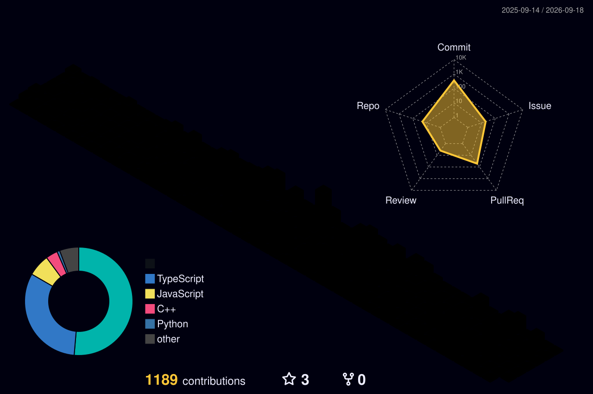

  <strong>Backend & Full-Stack Engineering · Application Security · Production Systems</strong>

  <a href="mailto:hamed.m.abdelalim@gmail.com">Email</a> ·
  <a href="https://github.com/7amed3li">GitHub</a> ·
  Open to opportunities in KSA, remotely, or on-site

---

## Profile

I am a **Software Engineer** focused on building dependable backend systems, practical web applications, and security tooling. My strongest areas are Node.js, TypeScript, React, performance optimization, and application security.

I care about measurable engineering outcomes: systems that handle real traffic, code that remains maintainable in production, and security improvements that reduce risk in meaningful ways.

| | |
|---|---|
| **Based in** | Tokat, Turkey |
| **Education** | B.Sc. Computer Engineering |
| **Languages** | Arabic (native) · English (B2) · Turkish (professional) |
| **Focus** | Backend systems · Full-stack applications · Application security |

---

## Engineering Impact

### QR Attendance Platform

Designed and built from the ground up, this production platform serves **2,000+ daily users**. I led a **3-person engineering team** and focused on reliability, performance, and scalable system design.

| Metric | Result |
|---|---:|
| Average response time | **94 ms → 1.5 ms** |
| Sustained throughput | **653 requests/second** |
| Key improvements | Hybrid JWT pipeline · Circuit Breaker · Dynamic resource allocation |

### NodeSecure

Contributed **7 merged pull requests** to [NodeSecure](https://github.com/NodeSecure), an open-source security project for the Node.js ecosystem. Contributions include SSRF detection, AST sensitivity modes, benchmarking infrastructure, and unsafe-randomness detection.

### DragonSploit

Building a vulnerability scanner that identifies the target technology stack before scanning, enabling a more context-aware workflow with fewer false positives and more useful results.

---

## Technical Toolkit

 

**Core:** Node.js · TypeScript · JavaScript · React · Next.js 
**Data & infrastructure:** PostgreSQL · MongoDB · Redis · Docker · Linux 
**Engineering interests:** Performance optimization · Secure API design · Vulnerability detection · Production reliability

---

## GitHub Activity

 

---

## GitHub Overview

---

## Let’s Connect

&nbsp;

 

Open to software engineering opportunities · KSA · Remote · On-site

